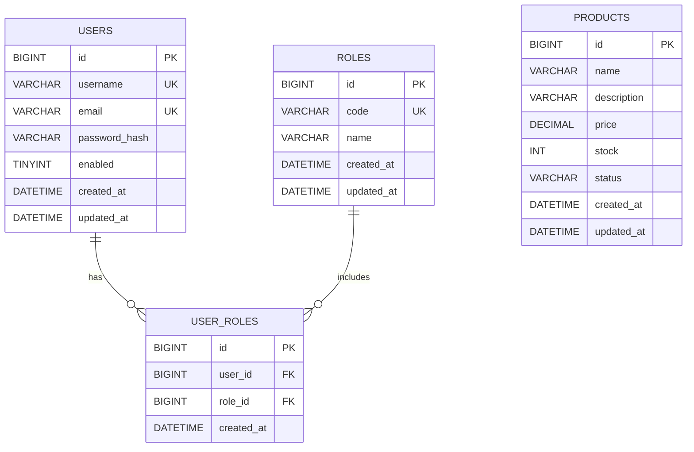

# 信息管理系统（Spring Boot + MyBatis-Plus + Thymeleaf + Security + Redis）

## 🛠 技术栈
- Frontend: Nginx 反向代理 + 原生 HTML/CSS/JavaScript（浅色现代科技风 UI）
- Backend: Java 17 + Spring Boot（Web / Thymeleaf / Security / Validation）
- ORM: MyBatis-Plus
- Database: MySQL 8.0（root / 123456）
- Cache: Redis 7（Spring Cache）

## 🚀 启动指南 (How to Run)
1. 确保 Docker Desktop 已启动。
2. 在目录 `label-3392` 执行：`docker compose up --build`
3. 首次启动会自动初始化数据库表结构，并自动写入演示数据。

## 🔗 服务地址 (Services)
- Frontend（入口）: http://localhost:3000
- Backend（直连）: http://localhost:8000
- Database: localhost:3306 (user: root / pass: 123456)
- Redis: localhost:6379

## ✨ 功能概览
- 注册/登录：Spring Security 表单认证，开启 CSRF 防护
- 角色权限：`ADMIN / USER`（仅管理员可新增/编辑/删除产品）
- 记住我：Remember-Me（1 天免登录）
- 产品管理：查询（名称模糊 + 价格区间）+ 分页（10 条/页）+ 详情页
- Redis 缓存：产品列表分页结果缓存 10 分钟；增/改/删自动清理缓存
- UI/交互：浅色现代科技风；列表区域固定高度、内部滚动；表头吸顶；超长文案省略

## 📌 功能入口
- 登录：`/login`
- 注册：`/register`
- 产品列表：`/products`
- 产品详情：`/products/{id}`
- 新增产品（ADMIN）：`/products/new`
- 编辑产品（ADMIN）：`/products/{id}/edit`

## ✅ 单元测试 (Tests)
- 运行后端测试：在目录 `label-3392` 执行 `docker compose --profile test run --rm backend-test`
- 测试说明：使用 H2 内存库（MySQL 模式）+ Spring Boot Test + MockMvc，缓存使用 `simple`（不依赖 Redis）。

## 🧪 测试账号
- Admin: admin / 123456
- User: user / 123456

## 🧷 Remember-Me（记住我）
- 登录页勾选“记住我（1 天）”后，会写入 `remember-me` Cookie（有效期 86400 秒）。
- 注意：如果你点击了“退出”，系统会同时清除 `JSESSIONID` 和 `remember-me`，此时不会再免登录。
- 如果你曾经勾选过“记住我”，即使下次登录不勾选也可能仍会被自动登录（因为浏览器里还保留着旧的 `remember-me` Cookie）。
  - 解决：退出登录一次，或在不勾选“记住我”的情况下重新登录（系统会主动清理旧的 `remember-me` Cookie）。
- 另外部分浏览器可能会“恢复会话”，导致 `JSESSIONID` 在重启浏览器后仍存在；这属于浏览器行为，不等同于 Remember-Me。

## 🧩 常见问题 (FAQ)
### 1) 为什么翻页会看到重复的 ID？
产品 `id` 是数据库主键，保证唯一。若你遇到“同一 ID 同时出现在第 1 页和第 2 页”，通常是因为排序字段（如 `updated_at`）存在大量相同值时分页顺序不稳定导致的记录漂移。本项目已使用 `updated_at DESC, id DESC` 作为稳定排序，避免跨页重复。

## 📄 数据库设计（DDL + ER）

### 表清单
- `users`：用户表（用户名/邮箱唯一；密码加密存储）
- `roles`：角色表（`ADMIN` / `USER`）
- `user_roles`：用户-角色关联表（多对多）
- `products`：产品信息表（用于列表查询、增删改）

### ER 图（Mermaid）


### 建表 SQL（DDL）
> 注意：该 SQL 会在 MySQL 容器首次初始化 volume 时自动执行。
```sql
-- 数据库由 docker-compose 通过 MYSQL_DATABASE=lab3392 自动创建
USE lab3392;

CREATE TABLE IF NOT EXISTS users (
  id BIGINT PRIMARY KEY AUTO_INCREMENT,
  username VARCHAR(50) NOT NULL UNIQUE,
  email VARCHAR(120) NOT NULL UNIQUE,
  password_hash VARCHAR(100) NOT NULL,
  enabled TINYINT(1) NOT NULL DEFAULT 1,
  created_at DATETIME NOT NULL DEFAULT CURRENT_TIMESTAMP,
  updated_at DATETIME NOT NULL DEFAULT CURRENT_TIMESTAMP ON UPDATE CURRENT_TIMESTAMP
) ENGINE=InnoDB DEFAULT CHARSET=utf8mb4;

CREATE TABLE IF NOT EXISTS roles (
  id BIGINT PRIMARY KEY AUTO_INCREMENT,
  code VARCHAR(50) NOT NULL UNIQUE,
  name VARCHAR(80) NOT NULL,
  created_at DATETIME NOT NULL DEFAULT CURRENT_TIMESTAMP,
  updated_at DATETIME NOT NULL DEFAULT CURRENT_TIMESTAMP ON UPDATE CURRENT_TIMESTAMP
) ENGINE=InnoDB DEFAULT CHARSET=utf8mb4;

CREATE TABLE IF NOT EXISTS user_roles (
  id BIGINT PRIMARY KEY AUTO_INCREMENT,
  user_id BIGINT NOT NULL,
  role_id BIGINT NOT NULL,
  created_at DATETIME NOT NULL DEFAULT CURRENT_TIMESTAMP,
  UNIQUE KEY uk_user_role (user_id, role_id),
  CONSTRAINT fk_user_roles_user FOREIGN KEY (user_id) REFERENCES users(id) ON DELETE CASCADE,
  CONSTRAINT fk_user_roles_role FOREIGN KEY (role_id) REFERENCES roles(id) ON DELETE CASCADE
) ENGINE=InnoDB DEFAULT CHARSET=utf8mb4;

CREATE TABLE IF NOT EXISTS products (
  id BIGINT PRIMARY KEY AUTO_INCREMENT,
  name VARCHAR(50) NOT NULL,
  description VARCHAR(255) DEFAULT NULL,
  price DECIMAL(10,2) NOT NULL DEFAULT 0.00,
  stock INT NOT NULL DEFAULT 0,
  status VARCHAR(20) NOT NULL DEFAULT 'ACTIVE',
  created_at DATETIME NOT NULL DEFAULT CURRENT_TIMESTAMP,
  updated_at DATETIME NOT NULL DEFAULT CURRENT_TIMESTAMP ON UPDATE CURRENT_TIMESTAMP,
  INDEX idx_products_name (name),
  INDEX idx_products_price (price)
) ENGINE=InnoDB DEFAULT CHARSET=utf8mb4;
```

## 🌱 初始化数据（Seed）
- 后端启动时会自动写入演示账号与产品数据：`admin/user` 密码均为 `123456`（BCrypt 加密存储）。
- 产品演示数据会插入到约 `85` 条（用于测试查询 + **分页（10 条/页）**）；如你已启动过旧版本，重新启动后端容器会自动补齐缺失的演示数据（按名称去重）。
- 若需要“清空重置”数据库：执行 `docker compose down -v`（会删除 MySQL/Redis volume）。
